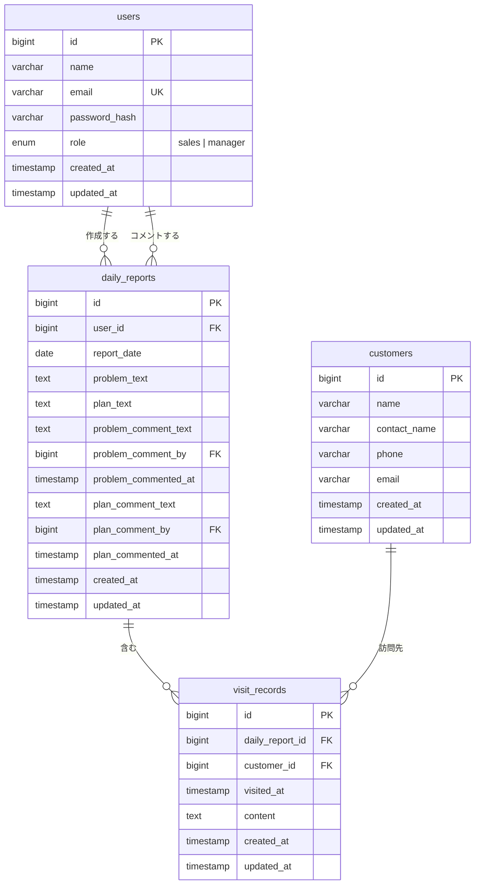

# 営業日報システム 設計

## 概要

営業担当者が日々の訪問活動・課題・翌日計画を記録し、マネージャーがコメントで指導・フィードバックできるシステム。

## 要件

| # | 要件 |
| --- | --- |
| 1 | 営業は当日訪問した顧客と訪問内容を報告できる。1日あたり複数行の訪問記録を追加可能。 |
| 2 | 日報に課題・相談（Problem）と明日やること（Plan）を記載できる。マネージャーはそれぞれに1件コメントを残せる。 |
| 3 | 顧客マスタと営業マスタ（ユーザー管理）が存在する。 |

## ロール

| ロール | 権限 |
| --- | --- |
| `sales` | 自分の日報を作成・編集 |
| `manager` | 全員の日報を閲覧・Problem/Plan にコメント |

組織はフラット（2ロールのみ）。承認フローなし。

## テーブル定義

### `users`（営業マスタ）

| カラム | 型 | 制約 | 説明 |
| --- | --- | --- | --- |
| id | bigint | PK | |
| name | varchar | NOT NULL | |
| email | varchar | NOT NULL, UNIQUE | ログインID |
| password_hash | varchar | NOT NULL | |
| role | enum | NOT NULL | `sales` / `manager` |
| created_at / updated_at | timestamp | NOT NULL | |

### `customers`（顧客マスタ）

| カラム | 型 | 制約 | 説明 |
| --- | --- | --- | --- |
| id | bigint | PK | |
| name | varchar | NOT NULL | 顧客名・会社名 |
| contact_name | varchar | | 担当者名 |
| phone / email | varchar | | |
| created_at / updated_at | timestamp | NOT NULL | |

### `daily_reports`（日報）

| カラム | 型 | 制約 | 説明 |
| --- | --- | --- | --- |
| id | bigint | PK | |
| user_id | bigint | FK → users, NOT NULL | 作成した営業 |
| report_date | date | NOT NULL | 日報対象日 |
| problem_text | text | | 課題・相談 |
| plan_text | text | | 明日やること |
| problem_comment_text | text | nullable | Problem への上長コメント |
| problem_comment_by | bigint | FK → users, nullable | |
| problem_commented_at | timestamp | nullable | |
| plan_comment_text | text | nullable | Plan への上長コメント |
| plan_comment_by | bigint | FK → users, nullable | |
| plan_commented_at | timestamp | nullable | |
| created_at / updated_at | timestamp | NOT NULL | |

UNIQUE: `(user_id, report_date)` — 1ユーザー×1日で1件

### `visit_records`（訪問記録）

| カラム | 型 | 制約 | 説明 |
| --- | --- | --- | --- |
| id | bigint | PK | |
| daily_report_id | bigint | FK → daily_reports, NOT NULL | |
| customer_id | bigint | FK → customers, NOT NULL | |
| visited_at | timestamp | NOT NULL | 訪問日時 |
| content | text | NOT NULL | 訪問内容 |
| created_at / updated_at | timestamp | NOT NULL | |

## ER図

## 技術スタック

| カテゴリ | 採用技術 | 備考 |
| --- | --- | --- |
| フレームワーク | Next.js（TypeScript） | App Router。フロント・API を一体管理 |
| DB / ORM | PostgreSQL + Prisma | 型安全スキーマ・マイグレーション管理 |
| 認証 | NextAuth.js | middleware でセッション検証・ロールガード |
| ホスティング | Vercel | CI/CD・プレビューデプロイ込み |

API は `app/api/` Route Handlers（REST）。未認証は `/login` へリダイレクト。`manager` 専用ページへの `sales` アクセスはサーバーサイドでブロック。

## 設計決定事項

| 決定 | 理由 |
| --- | --- |
| Problem/Plan コメントを `daily_reports` の直接カラムで管理 | 「1コメント固定」要件に別テーブル化は過剰 |
| `visit_records` に `visited_at` を持つ | 1日複数訪問の順序を記録するため |
| `(user_id, report_date)` のユニーク制約 | 1ユーザー×1日1件を保証 |
| 承認フローなし | コメントのみで十分、シンプルさを優先 |
