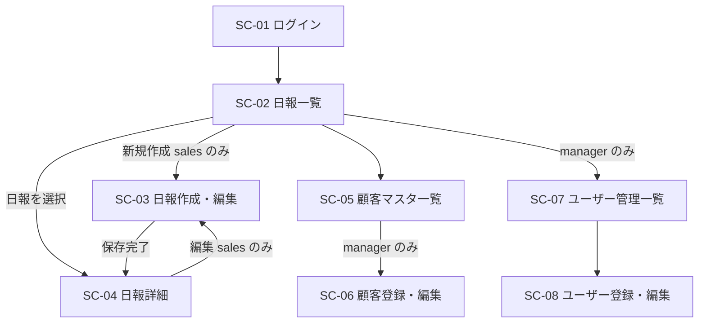

# 営業日報システム 画面定義書

## 画面一覧

| 画面ID | 画面名 | 権限 | 概要 |
| --- | --- | --- | --- |
| SC-01 | ログイン | 未認証 | メール・パスワード認証 |
| SC-02 | 日報一覧 | 全員 | sales は自分のみ・manager は全員＋担当者フィルター |
| SC-03 | 日報作成・編集 | sales（自分のみ） | 訪問記録複数行 ＋ Problem/Plan 入力 |
| SC-04 | 日報詳細 | 全員 | manager はコメント入力可 |
| SC-05 | 顧客マスタ一覧 | 全員閲覧 / manager 編集 | 顧客の一覧表示・管理 |
| SC-06 | 顧客登録・編集 | manager のみ | 顧客情報の登録・編集フォーム |
| SC-07 | ユーザー管理一覧 | manager のみ | ユーザー（営業マスタ）の一覧・管理 |
| SC-08 | ユーザー登録・編集 | manager のみ | ユーザー情報の登録・編集フォーム |

## 画面遷移図

## 各画面定義

### SC-01 ログイン

認証済みの場合は SC-02 へリダイレクト。

| 項目 | 種別 | 備考 |
| --- | --- | --- |
| メールアドレス | テキスト入力 | |
| パスワード | パスワード入力 | マスク表示 |
| ログインボタン | ボタン | 成功時 → SC-02 |
| エラーメッセージ | テキスト | 認証失敗時に表示 |

### SC-02 日報一覧

| 項目 | 種別 | 備考 |
| --- | --- | --- |
| 担当者フィルター | セレクトボックス | manager のみ表示 |
| 期間フィルター | 日付範囲 | デフォルトは当月 |
| 日付 | テキスト | |
| 担当者名 | テキスト | manager のみ表示 |
| 訪問件数 | 数値 | visit_records の件数 |
| コメント状況 | バッジ | Problem・Plan それぞれのコメント有無 |
| 新規作成ボタン | ボタン | sales のみ表示 → SC-03 |
| 顧客マスタリンク | リンク | → SC-05 |
| ユーザー管理リンク | リンク | manager のみ → SC-07 |
| ログアウト | リンク | → SC-01 |

日報行クリック → SC-04。

### SC-03 日報作成・編集

対象日は新規作成時に当日固定（変更不可）。

**訪問記録（複数行）**

| 項目 | 種別 | 備考 |
| --- | --- | --- |
| 顧客名 | セレクトボックス | 顧客マスタから選択。必須 |
| 訪問日時 | 日時入力 | 対象日と同日であること。必須 |
| 訪問内容 | テキストエリア | 必須 |
| 削除ボタン | ボタン | 行単位で削除 |

行追加ボタンで1行追加。

**Problem / Plan**

| 項目 | 種別 |
| --- | --- |
| 課題・相談（Problem） | テキストエリア |
| 明日やること（Plan） | テキストエリア |

保存 → SC-04。キャンセル → SC-04（編集時）/ SC-02（新規時）。

同一日の日報が既に存在する場合は新規作成不可。

### SC-04 日報詳細

| 項目 | 種別 | 備考 |
| --- | --- | --- |
| 対象日・担当者名 | テキスト | |
| 訪問記録リスト | テーブル | 顧客名・訪問日時・訪問内容 |
| Problem テキスト | テキスト | |
| Problem コメント欄 | テキストエリア | manager のみ入力可 |
| Problem コメント表示 | テキスト | コメント内容・コメント者・日時 |
| Plan テキスト | テキスト | |
| Plan コメント欄 | テキストエリア | manager のみ入力可 |
| Plan コメント表示 | テキスト | コメント内容・コメント者・日時 |
| 編集ボタン | ボタン | sales かつ自分の日報のみ → SC-03 |
| コメント保存ボタン | ボタン | manager のみ。Problem/Plan それぞれ個別に保存 |

### SC-05 顧客マスタ一覧

| 項目 | 種別 | 備考 |
| --- | --- | --- |
| 顧客名・担当者名・電話番号・メール | テキスト | |
| 編集ボタン | ボタン | manager のみ → SC-06 |
| 新規登録ボタン | ボタン | manager のみ → SC-06 |

### SC-06 顧客登録・編集

| 項目 | 必須 |
| --- | --- |
| 顧客名 | 必須 |
| 担当者名 | 任意 |
| 電話番号 | 任意 |
| メールアドレス | 任意 |

保存 / キャンセル → SC-05。

### SC-07 ユーザー管理一覧

| 項目 | 種別 | 備考 |
| --- | --- | --- |
| 氏名・メール・ロール | テキスト | |
| 編集ボタン | ボタン | → SC-08 |
| 新規登録ボタン | ボタン | → SC-08 |

### SC-08 ユーザー登録・編集

| 項目 | 必須 | 備考 |
| --- | --- | --- |
| 氏名 | 必須 | |
| メールアドレス | 必須 | ログインID |
| パスワード | 新規は必須 | 編集時は空欄で変更なし |
| ロール | 必須 | `営業` / `マネージャー` |

保存 / キャンセル → SC-07。
