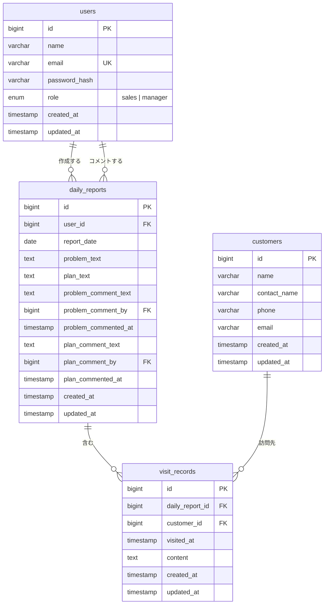

# 営業日報システム 設計ドキュメント

作成日: 2026-05-17

---

## 1. 概要

営業担当者が日々の訪問活動・課題・翌日計画を記録し、マネージャーがコメントで指導・フィードバックできる営業日報システム。

---

## 2. 要件

| # | 要件 |
|---|---|
| 1 | 営業は当日訪問した顧客と訪問内容を報告できる。1日あたり複数行の訪問記録を追加可能。 |
| 2 | 日報に今の課題・相談（Problem）と明日やること（Plan）を記載できる。マネージャーはそれぞれに1件コメントを残せる。 |
| 3 | 顧客マスタと営業マスタ（ユーザー管理）が存在する。 |

---

## 3. ユーザーロール

| ロール | 説明 |
|---|---|
| `sales`（営業） | 自分の日報を作成・編集できる |
| `manager`（マネージャー） | 全員の日報を閲覧し、Problem/Plan にコメントできる |

組織構造はフラット（2ロールのみ）。承認フローなし。

---

## 4. テーブル定義

### 4.1 `users`（営業マスタ）

| カラム | 型 | 制約 | 説明 |
|---|---|---|---|
| id | bigint | PK | |
| name | varchar | NOT NULL | 氏名 |
| email | varchar | NOT NULL, UNIQUE | ログインID |
| password_hash | varchar | NOT NULL | |
| role | enum | NOT NULL | `sales` / `manager` |
| created_at | timestamp | NOT NULL | |
| updated_at | timestamp | NOT NULL | |

### 4.2 `customers`（顧客マスタ）

| カラム | 型 | 制約 | 説明 |
|---|---|---|---|
| id | bigint | PK | |
| name | varchar | NOT NULL | 顧客名・会社名 |
| contact_name | varchar | | 担当者名 |
| phone | varchar | | 電話番号 |
| email | varchar | | メールアドレス |
| created_at | timestamp | NOT NULL | |
| updated_at | timestamp | NOT NULL | |

### 4.3 `daily_reports`（日報）

| カラム | 型 | 制約 | 説明 |
|---|---|---|---|
| id | bigint | PK | |
| user_id | bigint | FK → users, NOT NULL | 作成した営業 |
| report_date | date | NOT NULL | 日報対象日 |
| problem_text | text | | 課題・相談 |
| plan_text | text | | 明日やること |
| problem_comment_text | text | nullable | Problem への上長コメント |
| problem_comment_by | bigint | FK → users, nullable | コメントしたマネージャー |
| problem_commented_at | timestamp | nullable | |
| plan_comment_text | text | nullable | Plan への上長コメント |
| plan_comment_by | bigint | FK → users, nullable | コメントしたマネージャー |
| plan_commented_at | timestamp | nullable | |
| created_at | timestamp | NOT NULL | |
| updated_at | timestamp | NOT NULL | |

> ユニーク制約: `(user_id, report_date)` — 1ユーザー×1日で1件

### 4.4 `visit_records`（訪問記録）

| カラム | 型 | 制約 | 説明 |
|---|---|---|---|
| id | bigint | PK | |
| daily_report_id | bigint | FK → daily_reports, NOT NULL | 紐づく日報 |
| customer_id | bigint | FK → customers, NOT NULL | 訪問した顧客 |
| visited_at | timestamp | NOT NULL | 訪問日時 |
| content | text | NOT NULL | 訪問内容 |
| created_at | timestamp | NOT NULL | |
| updated_at | timestamp | NOT NULL | |

---

## 5. ER図

---

## 6. 設計上の決定事項

| 決定 | 理由 |
|---|---|
| Problem/Plan コメントを `daily_reports` に直接カラムとして持つ | 「1コメント固定」の要件に対して別テーブル化は過剰 |
| 訪問記録に `visited_at` を持つ | 1日複数訪問の順序を記録するため |
| `daily_reports` に `(user_id, report_date)` のユニーク制約 | 1ユーザー×1日1件の日報を保証するため |
| 承認フローなし | シンプルな運用を優先。コメントのみで十分と判断 |
