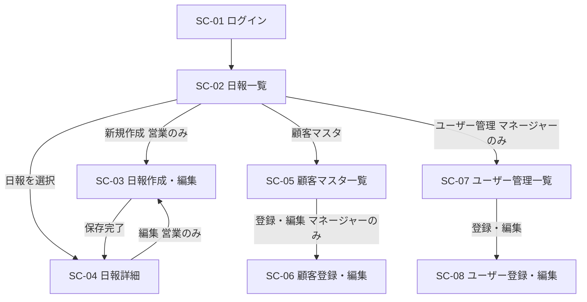

# 営業日報システム 画面定義書

作成日: 2026-05-17

---

## 1. 画面一覧

| 画面ID | 画面名 | アクセス権限 |
|--------|--------|-------------|
| SC-01 | ログイン画面 | 全ユーザー（未認証） |
| SC-02 | 日報一覧画面 | 全ユーザー |
| SC-03 | 日報作成・編集画面 | 営業（自分の日報のみ） |
| SC-04 | 日報詳細画面 | 全ユーザー |
| SC-05 | 顧客マスタ一覧画面 | 全ユーザー |
| SC-06 | 顧客登録・編集画面 | マネージャーのみ |
| SC-07 | ユーザー管理一覧画面 | マネージャーのみ |
| SC-08 | ユーザー登録・編集画面 | マネージャーのみ |

---

## 2. 画面遷移図

---

## 3. 各画面定義

---

### SC-01 ログイン画面

**概要:** システムへの入口。メールアドレスとパスワードで認証する。

**アクセス権限:** 未認証ユーザーのみ表示。認証済みの場合は SC-02 へリダイレクト。

#### 表示項目

| 項目 | 種別 | 備考 |
|------|------|------|
| メールアドレス | テキスト入力 | |
| パスワード | パスワード入力 | マスク表示 |
| ログインボタン | ボタン | |
| エラーメッセージ | テキスト | 認証失敗時に表示 |

#### アクション

| アクション | 説明 | 遷移先 |
|-----------|------|--------|
| ログイン | 認証成功時 | SC-02 日報一覧 |

---

### SC-02 日報一覧画面

**概要:** 日報の一覧を表示するメイン画面。営業は自分の日報のみ、マネージャーは全員分を閲覧できる。

**アクセス権限:** 全ユーザー

#### 表示項目

| 項目 | 種別 | 備考 |
|------|------|------|
| 担当者フィルター | セレクトボックス | マネージャーのみ表示。営業名で絞り込み |
| 期間フィルター | 日付範囲 | デフォルトは当月 |
| 日報リスト | テーブル | 下記カラムを表示 |
| └ 日付 | テキスト | report_date |
| └ 担当者名 | テキスト | マネージャーのみ表示 |
| └ 訪問件数 | 数値 | visit_records の件数 |
| └ コメント状況 | バッジ | Problem・Plan それぞれのコメント有無 |
| 新規作成ボタン | ボタン | 営業のみ表示 |
| ナビゲーション | リンク | 顧客マスタ／ユーザー管理（マネージャーのみ） |

#### アクション

| アクション | 説明 | 遷移先 |
|-----------|------|--------|
| 日報行をクリック | 日報の詳細を表示 | SC-04 日報詳細 |
| 新規作成 | 当日の日報を作成 | SC-03 日報作成・編集 |
| 顧客マスタ | 顧客一覧へ移動 | SC-05 顧客マスタ一覧 |
| ユーザー管理 | ユーザー一覧へ移動（マネージャーのみ） | SC-07 ユーザー管理一覧 |
| ログアウト | セッションを破棄 | SC-01 ログイン |

---

### SC-03 日報作成・編集画面

**概要:** 日報を新規作成または編集する画面。訪問記録を複数行追加できる。

**アクセス権限:** 営業のみ（自分の日報のみ編集可）

#### 表示項目

| 項目 | 種別 | 備考 |
|------|------|------|
| 対象日 | 日付表示 | 新規作成時は当日固定。変更不可 |
| **訪問記録セクション** | | |
| └ 訪問記録リスト | 繰り返し行 | 複数行追加可能 |
| └ └ 顧客名 | セレクトボックス | 顧客マスタから選択 |
| └ └ 訪問日時 | 日時入力 | |
| └ └ 訪問内容 | テキストエリア | |
| └ └ 削除ボタン | ボタン | 行単位で削除 |
| └ 行追加ボタン | ボタン | 訪問記録を1行追加 |
| **Problem セクション** | | |
| └ 課題・相談 | テキストエリア | |
| **Plan セクション** | | |
| └ 明日やること | テキストエリア | |
| 保存ボタン | ボタン | |
| キャンセルボタン | ボタン | |

#### アクション

| アクション | 説明 | 遷移先 |
|-----------|------|--------|
| 保存 | 日報を保存 | SC-04 日報詳細 |
| キャンセル | 編集を破棄 | SC-04 日報詳細（編集時）/ SC-02 一覧（新規時） |
| 行追加 | 訪問記録を1行追加 | 同画面 |
| 行削除 | 該当訪問記録を削除 | 同画面 |

#### バリデーション

| 項目 | ルール |
|------|--------|
| 訪問記録 | 顧客・訪問内容は両方必須 |
| 訪問日時 | 対象日と同日であること |
| 重複チェック | 同一日の日報が既に存在する場合は新規作成不可 |

---

### SC-04 日報詳細画面

**概要:** 日報の内容を閲覧する画面。マネージャーは Problem・Plan にコメントを入力できる。

**アクセス権限:** 全ユーザー

#### 表示項目

| 項目 | 種別 | 表示条件 |
|------|------|---------|
| 対象日 | テキスト | 常時 |
| 担当者名 | テキスト | 常時 |
| **訪問記録セクション** | | 常時 |
| └ 顧客名 | テキスト | |
| └ 訪問日時 | テキスト | |
| └ 訪問内容 | テキスト | |
| **Problem セクション** | | 常時 |
| └ 課題・相談 | テキスト | |
| └ コメント欄 | テキストエリア | マネージャーのみ入力可 |
| └ コメント表示 | テキスト | コメント済みの場合、コメント内容・コメント者・日時を表示 |
| **Plan セクション** | | 常時 |
| └ 明日やること | テキスト | |
| └ コメント欄 | テキストエリア | マネージャーのみ入力可 |
| └ コメント表示 | テキスト | コメント済みの場合、コメント内容・コメント者・日時を表示 |
| 編集ボタン | ボタン | 営業かつ自分の日報のみ表示 |
| コメント保存ボタン | ボタン | マネージャーのみ表示 |

#### アクション

| アクション | 説明 | 遷移先 |
|-----------|------|--------|
| 編集 | 日報を編集（営業のみ） | SC-03 日報作成・編集 |
| コメント保存 | Problem/Plan のコメントを保存（マネージャーのみ） | 同画面（再描画） |
| 一覧へ戻る | | SC-02 日報一覧 |

---

### SC-05 顧客マスタ一覧画面

**概要:** 登録されている顧客の一覧を表示する。

**アクセス権限:** 全ユーザー（閲覧）。登録・編集はマネージャーのみ。

#### 表示項目

| 項目 | 種別 | 備考 |
|------|------|------|
| 顧客リスト | テーブル | |
| └ 顧客名 | テキスト | |
| └ 担当者名 | テキスト | |
| └ 電話番号 | テキスト | |
| └ メールアドレス | テキスト | |
| └ 編集ボタン | ボタン | マネージャーのみ表示 |
| 新規登録ボタン | ボタン | マネージャーのみ表示 |

#### アクション

| アクション | 説明 | 遷移先 |
|-----------|------|--------|
| 新規登録 | 顧客を新規登録（マネージャーのみ） | SC-06 顧客登録・編集 |
| 編集 | 顧客情報を編集（マネージャーのみ） | SC-06 顧客登録・編集 |
| 戻る | | SC-02 日報一覧 |

---

### SC-06 顧客登録・編集画面

**概要:** 顧客情報を新規登録または編集する。

**アクセス権限:** マネージャーのみ

#### 表示項目

| 項目 | 種別 | 備考 |
|------|------|------|
| 顧客名 | テキスト入力 | 必須 |
| 担当者名 | テキスト入力 | |
| 電話番号 | テキスト入力 | |
| メールアドレス | テキスト入力 | |
| 保存ボタン | ボタン | |
| キャンセルボタン | ボタン | |

#### アクション

| アクション | 説明 | 遷移先 |
|-----------|------|--------|
| 保存 | 顧客情報を保存 | SC-05 顧客マスタ一覧 |
| キャンセル | 編集を破棄 | SC-05 顧客マスタ一覧 |

---

### SC-07 ユーザー管理一覧画面

**概要:** 登録されているユーザー（営業マスタ）の一覧を表示する。

**アクセス権限:** マネージャーのみ

#### 表示項目

| 項目 | 種別 | 備考 |
|------|------|------|
| ユーザーリスト | テーブル | |
| └ 氏名 | テキスト | |
| └ メールアドレス | テキスト | |
| └ ロール | テキスト | `営業` / `マネージャー` |
| └ 編集ボタン | ボタン | |
| 新規登録ボタン | ボタン | |

#### アクション

| アクション | 説明 | 遷移先 |
|-----------|------|--------|
| 新規登録 | ユーザーを新規登録 | SC-08 ユーザー登録・編集 |
| 編集 | ユーザー情報を編集 | SC-08 ユーザー登録・編集 |
| 戻る | | SC-02 日報一覧 |

---

### SC-08 ユーザー登録・編集画面

**概要:** ユーザー情報を新規登録または編集する。

**アクセス権限:** マネージャーのみ

#### 表示項目

| 項目 | 種別 | 備考 |
|------|------|------|
| 氏名 | テキスト入力 | 必須 |
| メールアドレス | テキスト入力 | 必須。ログインIDとなる |
| パスワード | パスワード入力 | 新規登録時は必須。編集時は空欄で変更なし |
| ロール | セレクトボックス | `営業` / `マネージャー` |
| 保存ボタン | ボタン | |
| キャンセルボタン | ボタン | |

#### アクション

| アクション | 説明 | 遷移先 |
|-----------|------|--------|
| 保存 | ユーザー情報を保存 | SC-07 ユーザー管理一覧 |
| キャンセル | 編集を破棄 | SC-07 ユーザー管理一覧 |
